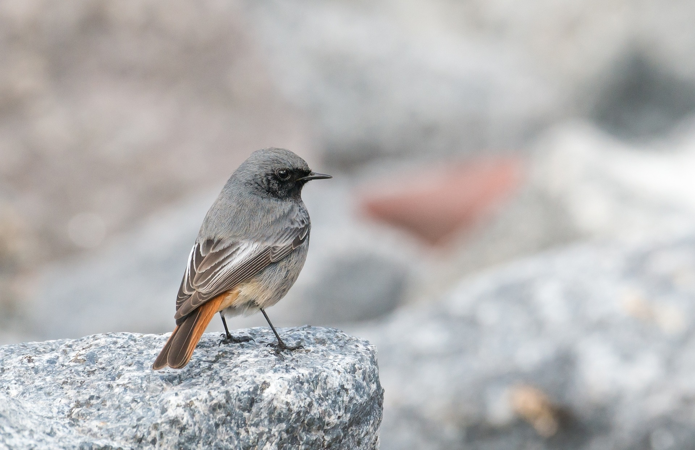

# Quatre clés pour identifier à coup sûr un oiseau

Quel plaisir que de pouvoir observer des oiseaux en train de virevolter dans le ciel, de construire leur nid ou de chasser pour leur progéniture ! Mais il n’est pas toujours pleinement satisfaisant de s’en tenir à la simple observation. Très rapidement nous vient l’envie de mettre un nom sur cet oiseau qui nous régale de ses acrobaties ou de son chant mélodieux. Par simple curiosité ou pour épater son entourage, apprendre à nommer ces petites bêtes ailées semble être un beau défi… mais difficile. Fort heureusement il n’est pas nécessaire de devenir un ornithologue confirmé pour y arriver. Quelques connaissances théoriques (que je m’apprête gentiment à vous révéler), un peu de patience et d’attention vous permettront à coup sûr de progresser dans ce domaine. Vous même allez vous surprendre quand vous saurez à coup sûr répondre à votre membre de la famille se demandant quel oiseau vous venez de croiser lors de la promenade dominicale. Alors laissez moi vous partager les premières clés qui vous ouvriront les portes de l’identification des oiseaux.

Commençons par une bonne nouvelle : la liste des espèces que vous pourrez observer presque quotidiennement n’est pas si longue. Il y a aussi des espèces que vous ne pourrez observer que durant une certaine saison mais qui reviendront chaque année. Reconnaître ces espèces qui sont présentes régulièrement près de chez vous ne demande donc pas trop de travail. Cela vous donne aussi un bon point de départ à partir duquel vous pourrez vous intéressez à des espèces plus rares ou présentes uniquement dans les régions que vous visitez. Pour identifier ces oiseaux communs, nous allons nous aider de quatre clés : le comportement, le plumage, la taille et la voix. Ces quatre clés ne sont bien sûr pas indépendantes les unes des autres, c’est à vous de les combiner pour les rendre encore plus puissantes.

Le comportement
Comme les humains, les oiseaux présentent une variété de comportements fascinante. Solitaire ou grégaire, farouche ou docile, adepte des fils électriques ou des arbres, migrateur ou présent à l’année voilà de nombreuses distinctions qui permettent bien souvent d’identifier l’espèce sans même à avoir à observer son plumage.

Autant un oiseau isolé n’est pas un indice probant sur son espèce, autant un regroupement d’oiseaux est rarement un hasard. Parmi les espèces les plus sociales nous retrouvons la mésange à longue queue, la grive litorne, la grive mauvis, ou encore le pinson du Nord. Ces oiseaux adorent la compagnie de leurs semblables et se retrouveront toujours en groupe pour rechercher de la nourriture durant les durs mois d’automne et d’hiver. Certaines espèces ne se regroupent que pour des circonstances particulières : aller dormir dans des dortoirs collectifs (bergeronnette grise, moineau domestique, pie bavarde, pigeon ramier) ou encore réaliser une parade collective (mésanges, corneilles, roitelets ou hirondelles). A l’inverse, l’épervier, le merle noir; le rougegorge ou les rougequeues préfèrent garder une certaine distance avec leurs congénères.

Rougequeue solitaire Pigeons grégaires
Le rougequeue est un solitaire endurci contrairement au grégaire pigeon ramier

Parmi ces oiseaux certains sont très farouches et ne se laissent pas approcher à plusieurs dizaines de mètres alors que d’autres n’hésitent pas à venir chercher de la nourriture aux pieds de enfants. Au sein de chaque espèce il a cependant des disparités, certains individus étant parfois plus curieux (imprudent ?). Des différences existent aussi entre les individus vivants en ville et les adeptes de la campagne, généralement plus sauvages.

Enfin, sachez que vous ne verrez jamais un pinson du Nord se promener dans votre jardin en été, celui-ci préférera amplement les régions septentrionales. Inversement, la tourterelle des bois n’apprécie guère notre climat hivernal, vous aurez donc peu de chance de l’observer durant les mois les plus froids de l’année. Suivant la région, des espèces pourront être présentes ou non. Il n’est cependant pas évident de dresser des cartes précises de répartition des oiseaux, ceux-ci étant par nature nomades.

Une tourtrelle des bois
La tourterelle des bois est un oiseau très farouche, présent uniquement en été, caché dans les feuillages et assez solitaire.

Le plumage
Le plumage est le première clé d’identification qui peut vous venir à l’esprit. Pourtant elle n’est pas aussi performante que l’observation des comportements. En effet, le plumage d’une espèce est bien souvent différente de l’idée que vous vous en faites à partir d’illustrations. De plus, la lumière du moment peut jouer sur les couleurs : le matin ou le soir les couleurs sont vivifiées alors que sous la lumière crue du soleil au zénith les contrastes sont diminués et les teintes plus pâles. Notez aussi que suivant la saison et l’âge de l’oiseau le plumage peut varier !

Malgré tout le plumage est une donnée intéressante à étudier ne serait-ce que pour des considérations d’ordre esthétiques. C’est aussi grâce au plumage que vous pourrez repérer les différences entre les individus d’une même espèce. Un oiseau présente en premier lieu une teinte de fond. Pour les oiseaux monochromes c’est leur unique couleur. C’est le cas des merles, corneilles et autres martinets noirs des pattes au bec. Ils existent de nombreuses autres teintes de fond comme le gris, le brun (teinte de très nombreuses espèces), le noir et blanc, le verdâtre ou le jaunâtre.

Par dessus cette teinte de fond viennent s’ajouter les détails du plumage. Les zones colorées peuvent de différentes natures, étendues ou restreintes. Certaines marques peuvent aussi apparaître de manière très localisées sur la tête, le croupion, les ailes ou la poitrine. Ces marques sont très utiles pour éviter de confondre des espèces.

Un roitelet à triple bandeau
Le roitelet à triple bandeau porte bien son nom : ses traces noires et jaunes sur sa tête permettent de l’identifier à coup sûr.

La taille et la forme
L'allure de l'hirondelle
Il n’est pas toujours évident d’estimer la taille d’un oiseau, en particulier si ce dernier est observé avec des jumelles. Pourtant c’est un indicateur précieux, vous reconnaîtrez ainsi facilement une mésange bleue à sa très petite taille (une dizaine de centimètres pour une moyenne de onze grammes). Vous pouvez vous donner quelques repères avec des oiseaux familiers pour estimer la taille. Par exemple, un moineau domestique mesure quatorze centimètres, un merle vingt cinq centimètres, alors qu’un pigeon ramier atteint les quarante centimètres.

Nos oiseaux présentent des formes variées, parfois tellement atypiques qu’il est possible de reconnaître avec cet unique critère. Un oiseau avec une huppe ne peut être qu’une mésange huppée, un jaseur boréal ou une huppe fasciée, et donc la dimension permet de les différencier. La queue peut être longue ou courte, échancrée (verdier, pinsons) ou de forme particulière (hirondelle rustique adulte). Enfin, la forme du bec est un indice précieux pouvant être court ou long, droit ou courbe, épais ou mince, pointu ou non. Une certaine proximité avec l’oiseau est nécessaire pour estimer correctement la forme du bec.

Ci-dessus vous reconnaîtrez sans mal une hirondelle, sans avoir besoin d’aucune autre information que sa forme.

Le chant
A l’aide des clés ci dessus, vous pourrez aisément reconnaître un individu en l’observant. Mais bien souvent le premier indicateur que vous aurez est le chant de l’oiseau. Les plus expérimentés arrivent ainsi à identifier de très nombreuses espèces uniquement à l’oreille. L’idéal est finalement d’arriver d’associer le sonore au visuel, pour pouvoir utiliser l’un ou l’autre suivant les conditions d’observation. Il n’y a qu’une seule façon d’apprendre à reconnaître un oiseau à son chant : aller sur le terrain, observer un oiseau, l’écouter faire ses vocalises, et enfin enregistrer mentalement l’association entre le son et l’espèce. Cette méthode demande une certaine assiduité et une bonne mémoire auditive.

Il est conseillé de se constituer sa banque sonore à la fin de l’hiver ou au début du printemps. A ce moment de l’année, il n’y a encore pas trop d’oiseaux, il est donc facile d’associer un chant à un individu en particulier. Au milieu du printemps cela sera plus compliqué quand les mélodies de différentes espèces se mélangeront dans un joyeux concert.

Les plus assidus arriveront à comprendre le comportement de certains oiseaux suivant leurs cris : alarmes, irritation, recherche de congénères, demande de nourriture des oisillons… De manière à progresser plus rapidement vous pourrez vous aider de banques sonores facilement disponibles sur internet.

Un roitelet à triple bandeau
Il n’est pas facile de reconnaître visuellement le rossignol, mais son chant est sans commune mesure.

Conclusion
L’observation et la reconnaissance des oiseaux est un exercice passionnant mais qui demande beaucoup de patience. Avec ces quatre différentes clés en tête, vous pourrez progresser plus rapidement. Dès que vous observez ou entendez un oiseau, pensez y et créez vous de petites fiches mentales pour chaque espèce vivant près de chez vous. En quelques semaines, avec de l’assiduité et de l’écoute vous allez vous surprendre à identifier de très nombreuses espèces. Alors la prochaine fois que vous sortez vous promener, pensez à lever la tête : de belles surprises parcourent le ciel !